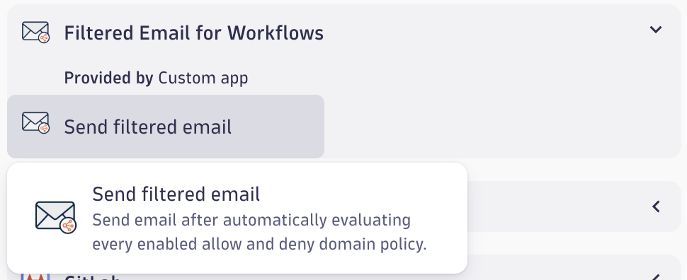
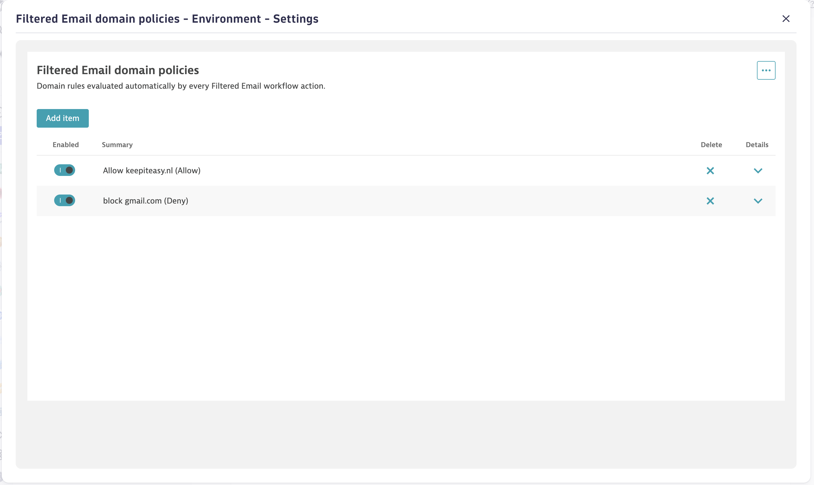

# Dynatrace Filtered Email for Workflows

Send email from Dynatrace workflows while controlling which recipient domains
are allowed.

> **Current version:** `0.4.1`

Filtered Email for Workflows evaluates recipients against every enabled allow
and deny domain policy before sending an email.

## Highlights

- Send email directly from Dynatrace workflows
- Configure recipients, subject, and message body
- Include workflow data in email content
- Allow trusted recipient domains
- Block restricted recipient domains
- Apply centrally managed domain policies automatically

## How it works

1. Configure domain policies in **Filtered Email domain policies**.
2. Add **Send filtered email** to a Dynatrace workflow.
3. Configure the email recipients and content.
4. The action evaluates each recipient against all enabled policies before
   sending.

## Domain policies

Open **Filtered Email domain policies** to manage the filtering rules used by
the workflow action.

### Allow policies

Use allow policies to define trusted domains. When an allow policy is enabled,
recipients must match an allowed domain.

### Deny policies

Use deny policies to prevent email from being sent to restricted domains. Deny
policies take precedence over allow policies.

Only enabled policies are evaluated. Enter domain names without `@`.

## Example policy settings

| Policy | Type | Domains | Enabled |
| --- | --- | --- | --- |
| Allow keepiteasy.nl | Allow | `keepiteasy.nl` | Yes |
| Block gmail.com | Deny | `gmail.com` | Yes |

With these settings:

- `user@keepiteasy.nl` is allowed.
- `user@gmail.com` is denied.
- A recipient from any other domain is denied because enabled allow policies
  restrict delivery to the listed domains.
